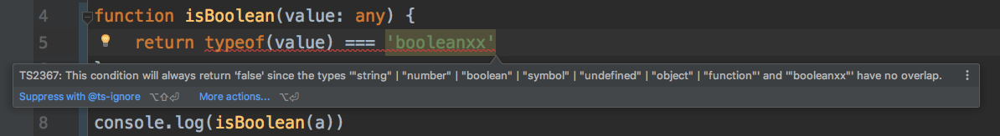

TypeScript Check If Value Is Boolean Demo
=========================================

```
npm install
npx ts-node hello.ts
```

Notice
------

`typeof(value) === 'boolean'` use a string `boolean` to check the type, seems a little unsafe, but typescript has checking on the string values.

If you made a typo, it will report errors:

